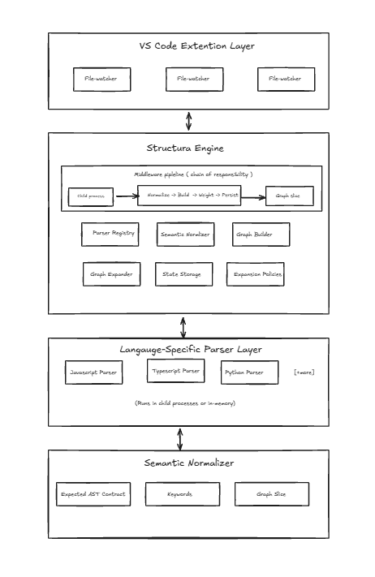
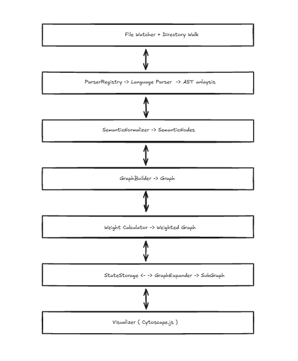

# Structura

<p align="center">
  
</p>

<p align="center">
  <strong>Next-generation code exploration for VS Code</strong><br>
  Visualize architecture as interactive, real-time graphs that adapt as you work
</p>

<p align="center">
  <a href="#installation">Installation</a> •
  <a href="#features">Features</a> •
  <a href="#usage">Usage</a> •
  <a href="#keyboard-shortcuts">Shortcuts</a> •
  <a href="#contributing">Contributing</a>
</p>

---

## Why Structura?

Understanding complex codebases shouldn't require mental gymnastics. Structura eliminates the cognitive overhead of navigating large projects by transforming your code into an interactive graph that reveals relationships, dependencies, and architecture at a glance.

### The Problem

- **Mental overhead**: Developers spend hours tracing dependencies manually
- **Lost context**: Switching between files breaks your mental model
- **Hidden complexity**: Circular dependencies and dead code lurk unseen
- **Onboarding friction**: New team members struggle to understand architecture

### The Solution

Structura provides a living architectural view that updates in real-time as you navigate, combining the keyboard-first efficiency of Neovim with the visual clarity of modern graph interfaces.

---

## Core Innovations

### 1. **Semantic-First Architecture**


Structura abstracts language-specific AST nodes into universal intents (imports, exports, definitions, calls), enabling true multi-language support and future AI integration.

```
JavaScript ImportDeclaration  ─┐
Python Import                  ├─→ "import" intent
Go import statement            ┘
```

This revolutionary approach not only helps humans understand code faster but also opens possibilities for LLM-powered code intelligence.

### 2. **Keyboard-First Navigation**

Inspired by Neovim, Structura provides just enough keyboard shortcuts to explore code graphically without leaving the keyboard:

- `Ctrl+S+O` - Open current file as graph node
- `Ctrl+S+E+[1-9]` - Expand graph to depth 1-9
- `Ctrl+S+F` - Filter graph interactively
- `Ctrl+S+I/K/J/L` - Navigate nodes (up/down/left/right)
- `Ctrl+S+K+E` - Expand selected node
- `Ctrl+S+B/F` - Time travel (back/forward in history)

All shortcuts are complemented by intuitive right-click context menus.

### 3. **Intelligent State Management**

Structura optimizes for speed through:
- **Incremental exploration**: Navigate through graph history with time-travel commands
- **Smart caching**: Only re-parses changed files
- **Checkpoint system**: State persists in `.structura` folder
- **Ignore patterns**: Use `.structuraignore` for fine-grained control within vs code extention configuration

### 4. **Documentation Integration** *(Planned)*

One-to-one mapping between code files and documentation, with future support for:
- Integration with documentation tools like CodeRabbit
- Agentic AI auto-documentation
- Inline doc display in graph tooltips

---

## Features

### Current (v0.1.0)

- 🔍 **Automatic Code Analysis** - Intelligent AST parsing for deep insights
- 📊 **Interactive Graph Visualization** - Pan, zoom, and explore with Cytoscape.js
- 🎯 **Smart Navigation** - Click nodes to see connections, double-click to open files
- ⚡ **Real-Time Updates** - Graph adapts as you navigate your codebase
- ⌨️ **Keyboard-First** - Neovim-inspired shortcuts for maximum productivity
- 🎨 **Semantic Coloring** - Nodes colored by intent (imports, exports, definitions, calls)
- ⚙️ **Highly Configurable** - Customize base directory, ignore patterns, and more
- 🚀 **Performance Optimized** - Handles large codebases efficiently

### Supported Languages

- ✅ JavaScript (`.js`, `.mjs`, `.cjs`)
- ✅ TypeScript (`.ts`, `.tsx`)
- ✅ JSX (`.jsx`)
- 🔜 Python *(coming soon)*
- 🔜 Go, Rust, Java *(contributors needed!)*

### Detected Relationships

- ES6 imports: `import X from 'Y'`
- CommonJS: `require('X')`
- Dynamic imports: `import('X')`
- Function/class definitions
- Function calls and references

---

## Installation

### From VS Code Marketplace

1. Open VS Code
2. Press `Ctrl+Shift+X` to open Extensions
3. Search for "Structura"
4. Click **Install**

### From Source

```bash
# Clone the repository
git clone https://github.com/yourusername/structura.git
cd structura

# Install dependencies and package
npm install
npm install -g vsce
npm run package

# Install the generated .vsix file
code --install-extension structura-0.1.0.vsix
```

---

## Usage

### Opening the Graph

**Method 1:** Click the **Structura** icon in the status bar (bottom right)

**Method 2:** Open Command Palette (`Ctrl+Shift+P`) and run:
```
Structura: Show Code Graph
```

**Method 3:** Use keyboard shortcut: `Ctrl+Shift+G`

### Basic Navigation

#### Mouse Controls
- **Click** a node → Highlight its connections
- **Double-click** a node → Open the file in editor
- **Drag** → Pan around the graph
- **Scroll** → Zoom in/out

#### Keyboard Controls
- **X** or **Esc** → Clear selection
- **O** → Open selected file
- **Arrow keys** → Navigate between nodes *(when enabled)*

### Graph Exploration Workflow

1. **Start with current file**: Open any file, then activate Structura
2. **Explore dependencies**: Click nodes to see what they import/call
3. **Expand selectively**: Right-click nodes to expand their connections
4. **Filter as needed**: Use the filter bar to focus on specific files or patterns
5. **Navigate freely**: Double-click any node to jump to that file

### Advanced Features

#### Time Travel
- `Ctrl+S+B` - Go back in graph history
- `Ctrl+S+F` - Go forward in graph history

#### Expansion Control
- `Ctrl+S+E+3` - Expand graph 3 levels deep
- `Ctrl+S+E+5` - Expand graph 5 levels deep
- Configure default depth in settings

#### Refreshing
Click the **Refresh** button in the graph header to regenerate after code changes, or enable auto-refresh in settings.

---

## Configuration

### VS Code Settings

Open Settings (`Ctrl+,`) and search for "Structura":

#### `structura.baseDirectory`
Base directory to analyze (relative to workspace root)

```json
{
  "structura.baseDirectory": "./src"
}
```

#### `structura.ignorePatterns`
File/folder patterns to exclude from analysis

```json
{
  "structura.ignorePatterns": [
    "node_modules",
    "dist",
    "build",
    ".git",
    "**/*.test.js",
    "**/*.spec.ts"
  ]
}
```

#### `structura.maxDepth`
Maximum depth for graph expansion (default: 3)

```json
{
  "structura.maxDepth": 3
}
```

#### `structura.autoRefresh`
Automatically refresh graph when files change (default: true)

```json
{
  "structura.autoRefresh": true
}
```


---

## Keyboard Shortcuts

### Graph Operations
| Shortcut | Action |
|----------|--------|
| `Ctrl+Shift+G` | Toggle graph panel |
| `Ctrl+S+O` | Open current file in graph |
| `Ctrl+S+E+[1-9]` | Expand to depth 1-9 |
| `Ctrl+S+F` | Focus filter input |
| `Ctrl+S+K+E` | Expand selected node |

### Navigation
| Shortcut | Action |
|----------|--------|
| `Ctrl+S+I` | Navigate up |
| `Ctrl+S+K` | Navigate down |
| `Ctrl+S+J` | Navigate left |
| `Ctrl+S+L` | Navigate right |
| `O` | Open selected node's file |
| `X` / `Esc` | Clear selection |

### History
| Shortcut | Action |
|----------|--------|
| `Ctrl+S+B` | Go back in history |
| `Ctrl+S+F` | Go forward in history |

### Documentation *(Planned)*
| Shortcut | Action |
|----------|--------|
| `Ctrl+S+O+P` | Open documentation panel |

> **Note:** All keyboard shortcuts are customizable via VS Code's keyboard settings.

---

## Architecture

# High Level Architecture



Structura follows a **layered architecture** that separates concerns while enabling seamless language-agnostic code visualization.

## Architectural Layers

### **Layer 1: VS Code Extension Layer** (User Interface)
The presentation layer that interacts directly with developers through VS Code's extension API.

- **Directory Walker** - Recursively discovers source files in workspace
- **Web View Panel** - Renders interactive graph visualization using Cytoscape.js
- **File Watcher** - Monitors file system changes for real-time updates
- **Command Handler** - Processes VS Code commands and user interactions
- **Status Bar** - Shows current parsing state and quick actions

### **Layer 2: Structura Engine** (Core Processing Middleware)
The brain of the system implementing the **Chain of Responsibility** pattern through a configurable pipeline.

**Middleware Pipeline:**
1. **File Reader** → 2. **Parser Selector** → 3. **AST Generator** → 4. **Graph Builder** → 5. **Weight Calculator** → 6. **State Persister**

**Key Subsystems:**
- **Child Process Manager** - Executes parsers in isolated processes
- **Normalization Pipeline** - Normalize → Build → Weight → Persist
- **Graph Slice Generator** - Creates focused subgraphs for visualization
- **Parser Registry** - Manages language-specific parser implementations
- **Semantic Normalizer** - Maps language AST to universal semantic nodes
- **Graph Builder** - Constructs dependency graphs from semantic nodes
- **Graph Expander** - Extracts context-relevant subgraphs using policies
- **State Storage** - Manages graph persistence with checkpointing
- **Expansion Policies** - Configurable rules for graph traversal

### **Layer 3: Language-Specific Parser Layer**
Pluggable parsers that convert source code to abstract syntax trees (ASTs).

**Current Support:**
- **JavaScript Parser** - Using @babel/parser
- **TypeScript Parser** - Using TypeScript compiler API
- **Python Parser** - Using Python's ast module via child process
- **[+more]** - Extensible through plugin system

**Execution Model:**
- Runs in **child processes** for isolation and crash protection
- Can run **in-memory** for performance-critical scenarios
- Language definitions configure semantic mapping and weights

### **Layer 4: Semantic Normalizer Foundation**
The universal abstraction layer that makes Structura truly language-agnostic.

**Core Components:**
- **Expected AST Contract** - Language-to-universal node mapping
- **Keyword Extractor** - Identifies semantic keywords from code
- **Graph Slice Schema** - Standardized representation for visualization
- **Language Definitions** - Configurable mappings per language

---

## Low Level Architecture



Structura implements **Clean Architecture** principles with a focus on SOLID design:

### **Core Domain Layer** (Business Logic)
- **Graph Models** - `Graph`, `GraphNode`, `GraphEdge` domain entities
- **Semantic Models** - `SemanticNode`, `SemanticIntent` value objects
- **Expansion Policies** - Business rules for graph traversal
- **Language Definitions** - Domain-specific language configurations

### **Application Layer** (Use Cases)
- **Processing Pipeline** - Orchestrates the parse-normalize-build-weight-persist flow
- **Graph Operations** - Expand, find paths, detect cycles, calculate weights
- **Parser Coordination** - Manages parser execution and result aggregation

### **Interface Adapters** (Ports & Adapters)
- **Parser Registry** - Adapter for language-specific parsers
- **State Storage** - Adapter for persistence (filesystem, memory, cloud)
- **Visualizer** - Adapter for rendering engines (Cytoscape.js, D3.js)
- **Event System** - Adapter for component communication

### **Infrastructure Layer** (Frameworks & Drivers)
- **VS Code Extension API** - Platform-specific integration
- **File System Access** - OS-level file operations
- **Child Process Management** - Process isolation and IPC
- **External Parser Libraries** - Babel, TypeScript compiler, etc.

---

## Key Architectural Patterns

### **Chain of Responsibility** (Middleware Pipeline)
Each processing step (`Handler`) can process, modify, or pass along data, enabling flexible pipeline composition.

### **Ports & Adapters** (Hexagonal Architecture)
Core business logic remains independent of external systems through defined interfaces.

### **Strategy Pattern** (Language Parsers)
Interchangeable parser implementations following the `ILanguageParser` interface.

### **Observer Pattern** (Real-time Updates)
File watchers and event listeners enable reactive architecture updates.

### **Factory Pattern** (Component Creation)
Centralized creation of parsers, visualizers, and storage adapters.

---

## Data Flow

```
VS Code Extension (UI)
        ↓
File Watcher + Directory Walker
        ↓
Parser Registry → Language Parser → AST Analysis
        ↓
Semantic Normalizer → Universal Semantic Nodes
        ↓
Graph Builder → Dependency Graph
        ↓
Weight Calculator → Weighted Graph
        ↓
State Storage ← → Graph Expander → Contextual Subgraph
        ↓
Visualizer (Cytoscape.js) → Interactive Visualization
```

---

## Design Principles

1. **SOLID Compliance** - Each component has single responsibility, open for extension
2. **Language Agnostic** - Core works with any language through semantic normalization
3. **Real-time Reactive** - Updates propagate instantly as code changes
4. **Performance First** - Smart caching, incremental updates, parallel processing
5. **Extensible Core** - Plugin system for new languages, visualizers, and analyzers


---

## Project Structure

```
structura/
├── src/                         
│   ├── core/
│   │   ├── Directory.ts
│   │   ├── FileWatcher.ts 
│   │   ├── TSParser.ts
│   │   ├── Visitors.ts 
│   │   ├── Walker.ts 
│   ├── extension.ts   
│   ├── utilities # source code utilties
│   ├── parsers/
│   │   ├── executor.ts               # ParserExecutor (spawns child processes)
│   │   ├── registry.ts               # ParserRegistry (manages parsers)
│   │   ├── contract.ts               # TypeScript interfaces for JSON contract
│   │   └── validator.ts              # Validates parser output
│   ├── graph/
│   │   ├── builder.ts
│   │   ├── expander.ts
│   │   └── weights.ts
│   ├── storage/
│   │   └── filesystem.ts
│   └── ui/
│       ├── panel.ts
│       └── visualizer.ts
│
├── parsers/                          # Native language parsers
│   │
│   ├── javascript/                   # JavaScript/TypeScript parser
│   │       └── parse                 # Executable entry point
│   │
│   ├── python/                       # Python parser
│   │     └── parse                 # Executable: #!/usr/bin/env python3
│   │
│   ├── go/                        # Go parser
│   │    └── parse                 # Compiled binary
│   │
│   ├── rust/                         # Rust parser
│   │    └── parse                 # Compiled binary
│   │
│   └── java/                         # Java parser
│         └── parse                 # Launch script
│
├── definitions/                      # Language semantic mappings
│   ├── javascript.json
│   ├── python.json
│   ├── go.json
│   ├── rust.json
│   └── java.json
│
├── test
│   ├── extension.test.ts
│   ├── unit # unit tests 
│   ├── e2e # integration tests
├── scripts/
│   ├── build-parsers.sh              # Build all parsers
│   ├── test-parsers.sh               # Test all parsers
│   └── package-parsers.sh            # Package parsers for distribution
│
├── package.json                      # Extension manifest
├── tsconfig.json
└── README.md
```

---

## Development

### Prerequisites

- Node.js 16+ and npm
- VS Code 1.80+

### Setup

```bash
# Clone repository
git clone https://github.com/yourusername/structura.git
cd structura

# Install dependencies
npm install

# Open in VS Code
code .
```

### Running the Extension

1. Press `F5` to launch Extension Development Host
2. Open any project folder
3. Activate Structura via status bar or Command Palette

### Building

```bash
# Compile TypeScript
npm run build

# Watch for changes
npm run watch

# Run tests
npm run test

# Package extension
npm run package
```

### Contributing a Parser

To add support for a new language:

1. Create language definition in `definitions/[language].json`
2. Implement `ILanguageParser` interface
3. Register parser in `ParserRegistry`
4. Add tests

See [CONTRIBUTING.md](./CONTRIBUTING.md) for detailed guidelines.

---

## Roadmap

### Phase 1: MVP (Current - v0.1.0)
- [x] JavaScript/TypeScript parsing
- [x] Interactive graph visualization
- [x] Basic keyboard navigation
- [x] Real-time file tracking
- [x] State persistence

### Phase 2: Intelligence (v0.2.0 - Q2 2025)
- [ ] LLM-powered edge descriptions
- [ ] Circular dependency detection
- [ ] Dead code identification
- [ ] Architecture anti-pattern warnings
- [ ] Smart refactoring suggestions

### Phase 3: Multi-Language (v0.3.0 - Q3 2025)
- [ ] Python support
- [ ] Go support
- [ ] Rust support
- [ ] Java support
- [ ] Generic parser framework

### Phase 4: Enhanced UX (v0.4.0 - Q4 2025)
- [ ] Full Vim-style navigation
- [ ] Advanced filtering
- [ ] Graph export (PNG, SVG, Mermaid)
- [ ] Custom themes
- [ ] Share graph views

### Phase 5: Documentation (v0.5.0 - Q1 2026)
- [ ] File-to-doc mapping
- [ ] Auto-generate docs from graph
- [ ] JSDoc/docstring integration
- [ ] Documentation coverage heatmap

### Phase 6: Collaboration (v0.6.0 - Q2 2026)
- [ ] Git integration
- [ ] Team annotations
- [ ] Code review mode
- [ ] Shared graph exploration

---

## Contributing

We welcome contributions! Structura is designed for both user and contributor joy.

### Areas We Need Help

- **Parser Development**: Add support for Python, Go, Rust, Java
- **Testing**: Write tests for edge cases and real-world codebases
- **Documentation**: Improve guides and examples
- **Performance**: Optimize for larger codebases
- **UI/UX**: Design improvements and new features

### How to Contribute
Important : checkout <a href="parser.md"> Parsers</a>
1. Fork the repository
2. Create a feature branch (`git checkout -b feature/amazing-feature`)
3. Make your changes
4. Add tests
5. Commit with clear messages (`git commit -m 'Add Python parser'`)
6. Push to your fork (`git push origin feature/amazing-feature`)
7. Open a Pull Request

See [CONTRIBUTING.md](./CONTRIBUTING.md) for detailed guidelines.

---

## Technology Stack

- **Runtime**: Node.js
- **Language**: TypeScript
- **Extension API**: VS Code Extension API
- **AST Parsing**: 
  - JavaScript/TypeScript: `@babel/parser`, TypeScript Compiler API
  - Python (planned): Python `ast` module via child process
- **Graph Theory**: Cytoscape.js
- **UI**: HTML, CSS, Webview API
- **Future**: Tree-sitter for universal language support

---

## Performance

Structura is optimized for speed and responsiveness:

- **Incremental parsing**: Only re-parses changed files
- **Smart caching**: Avoids redundant AST generation
- **Parallel processing**: Utilizes multiple CPU cores
- **Lazy loading**: On-demand graph expansion
- **Virtual rendering**: Handles 10,000+ node graphs smoothly

### Benchmarks (Target)

- Parse 1,000-file codebase: < 30 seconds
- Load graph visualization: < 1 second
- Expand node: < 100ms
- Switch files: < 50ms
- Memory usage: < 200MB for 10,000 nodes

---

## FAQ

### Q: Does Structura work with monorepos?
**A:** Yes! Configure `structura.baseDirectory` to target specific packages, or use multiple instances.

### Q: Can I use Structura with large codebases (10,000+ files)?
**A:** Yes, Structura uses smart caching and incremental parsing. Initial analysis may take a few minutes, but subsequent updates are fast.

### Q: Does Structura require internet access?
**A:** No. Structura works entirely offline. LLM features (planned) are optional and require API keys.

### Q: How does Structura compare to [other tool]?
**A:** Structura is unique in its semantic-first, language-agnostic approach and keyboard-first UX. Most tools are language-specific or mouse-dependent.

### Q: Can I export graphs to share with my team?
**A:** Export features (PNG, SVG, Mermaid) are planned for v0.4.0.

### Q: Is there a CLI version?
**A:** Not yet, but it's on the roadmap for CI/CD integration and automated documentation.

---

## Support

- **Issues**: [GitHub Issues](https://github.com/yourusername/structura/issues)
- **Discussions**: [GitHub Discussions](https://github.com/yourusername/structura/discussions)
- **Email**: support@structura.dev
- **Twitter**: [@StructuraDev](https://twitter.com/StructuraDev)

---

## License

MIT License - see [LICENSE](./LICENSE) for details.

---

## Acknowledgments

Structura stands on the shoulders of giants:

- **Neovim** - Keyboard-first philosophy
- **Cytoscape.js** - Graph visualization
- **Babel** - JavaScript parsing
- **VS Code** - Extensibility platform
- **Tree-sitter** - Future language support

Special thanks to all contributors who make Structura better every day.

---

<p align="center">
  <strong>Built with ❤️ by developers, for developers</strong><br>
  <sub>Making code exploration delightful, one graph at a time</sub>
</p>

<p align="center">
  <a href="#installation">Get Started</a> •
  <a href="https://github.com/yourusername/structura">Star on GitHub</a> •
  <a href="https://twitter.com/StructuraDev">Follow Updates</a>
</p>